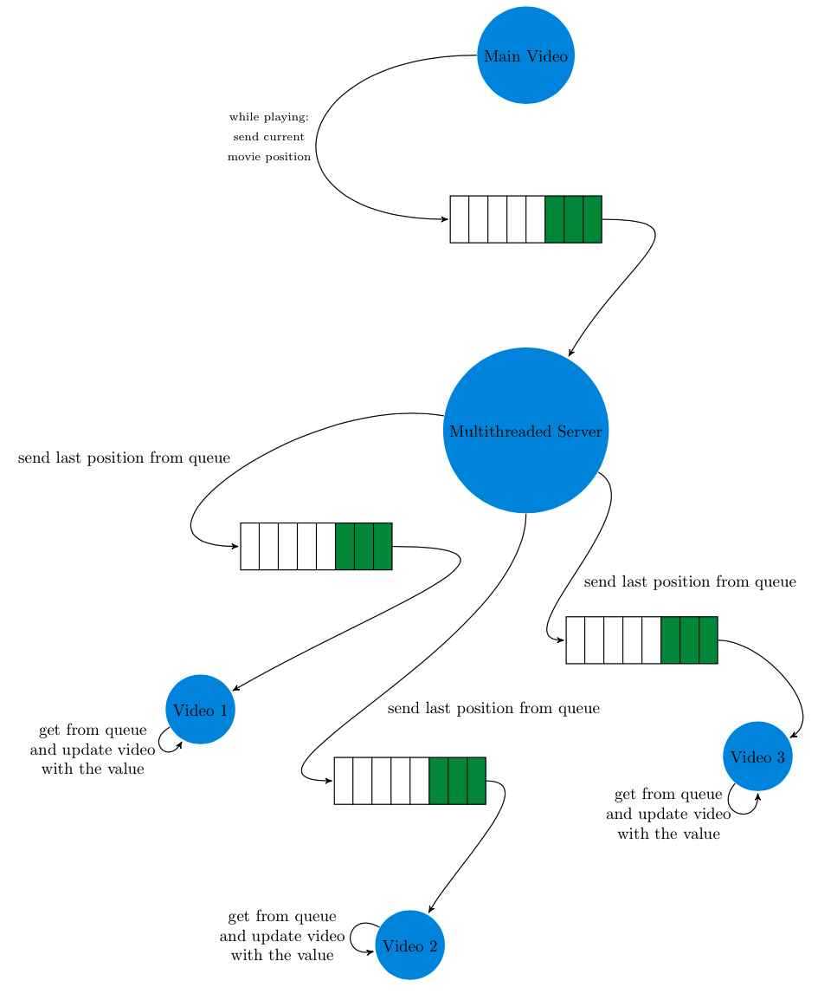

## Video Synchronization with python-vlc

Each video player is launched as a separate process. `main.py` is the entry point into the program. It creates the "main" video player with all of its respective controls. The main video player is started alongside a multithreaded server that "broadcasts" signals (e.g. play, pause, stop, and etc.) and the current time of the video player, to all client/slave videos. Specifically, this is accomplished by putting the current time or the signal of the main video player into a `queue` (FIFO). The multithreaded server gets the value from the queue and sends the value to each connected client.

In a somewhat similar fashion, each "slave" video player is launched as a separate process, along with a client. The client has a `data_receiver` thread that continuously listens for data, receives data, parses the data, and puts the data into a `queue` that is specific to that "slave" video player. The "slave" video player gets the value from the queue and updates itself in accordance with that value.

In order to facilitate interprocess communication, UNIX domain sockets are used to send and receive data. For the time being, Windows users have to use TCP/IP sockets.

Note: for the sake of clarity, the figure only shows the case of 3 client/slave videos.
